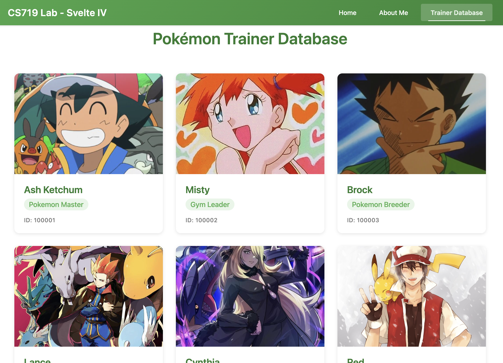
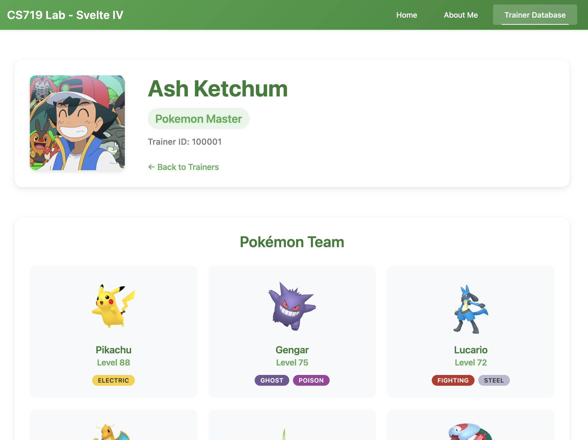
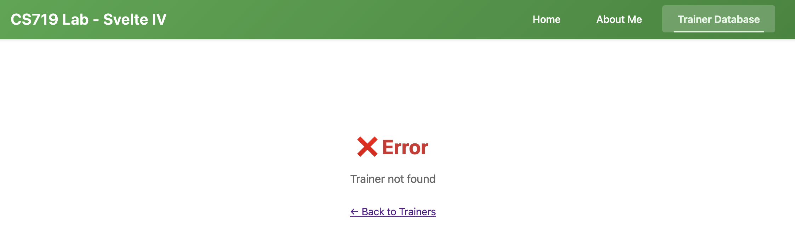
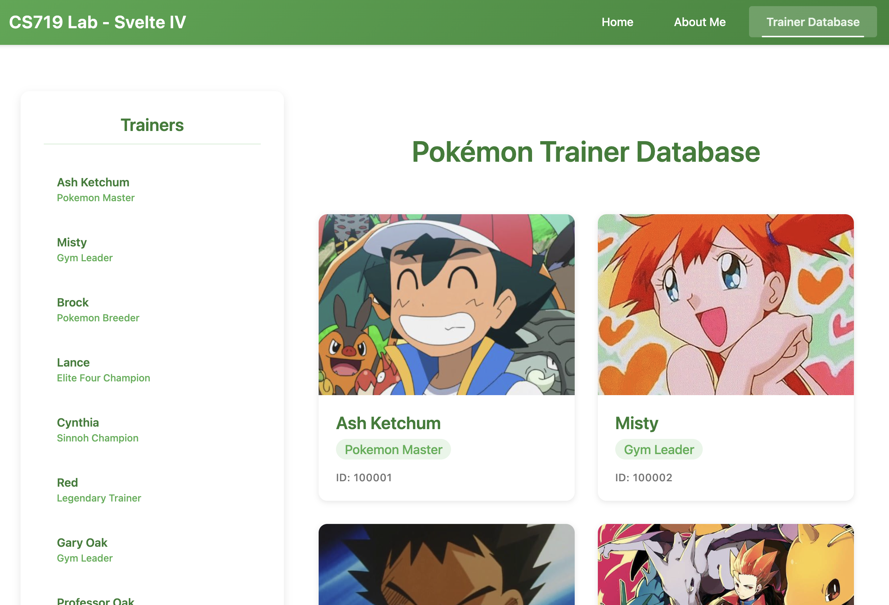
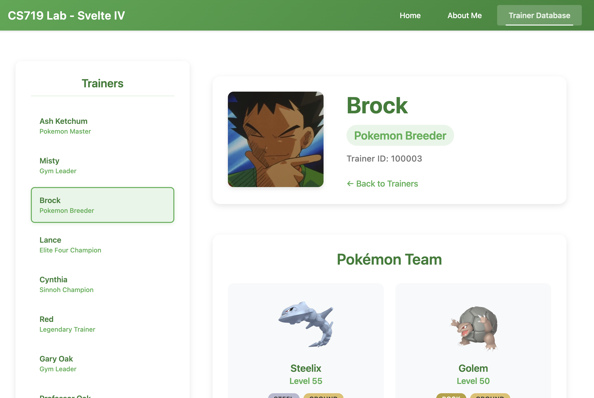

# COMPSCI 719 Lab: Svelte IV - Multi-page applicateions

In this lab, we'll continue gaining experience with Svelte, along with its recommended framework, SvelteKit. We will cover simple and complex use cases for multi-page applications.

Before starting, remember to run `npm install` in the root directory (the same one as this README) in order to install this project's dependencies.

## Exercise One - About Me

To begin, create a new "About Me" page. When the user navigates to `/about`, this page should appear.

To do this, create a new folder in the `routes` directory, called `about`, and add a `+page.svelte` file to it. Make this page display whatever information you want - it's up to you.

Now, in the _root_ page (i.e. `routes/+page.svelte`), edit the link list to add a hyperlink to your new page. Then, when running the app, make sure that you can navigate to your new page either by clicking the link or by manually navigating to <http://localhost:5173/about>.

Finally, in your about page, give it a custom `<title>` (using `<svelte:head>`) if you have not already done so.

## Exercise Two - Shared navbar

Having our list of links on the homepage is all well and good, but usually we'll want this list available from _all_ our pages. To do this, let's add a navbar to `routes/+layout.svelte`. Add a `<nav>` element at the marked location, and within it, add links to the homepage (`/`) and about page (`/about`).

Now, when you run the app, this navbar should appear above all other components, regardless of which page you're on!

### Styling

Once you've gotten the functionality working, have a go at styling the navbar. You can look at the "multi-page apps" example for inspiration, or style yourself from scratch.

### Conditional styling

Finally, apply _conditional_ styling to each navbar link, depending on whether that link is _active_. You can do this by importing the SvelteKit `page` object, and then checking `page.url.pathname`. If it matches a certain value, you can apply another CSS class, e.g. `active`. For example:

```svelte
<script>
  import { page } from "$app/state";
  let path = $derived(page.url.pathname);
</script>

<a href="/about" class:active={path.startsWith("/about")}>About</a>
```

## Exercise Three - Pokemon Trainers page

In this exercise, we'll add a new page which will display information about Pokemon trainers.

Create a new folder in the `routes` folder, called `trainers`, and create a `+page.svelte` file inside. Add a new link to your shared Navbar, linking to `/trainers`, so you can access this new page in your app.

In that page, using `fetch()`, `async` functions and `onMount()`, (from the previous lab), load data from the following API:

- <https://pkserve.ocean.anhydrous.dev/api/trainers>

This API contains the `trainerId`, `name`, `rank`, and `image` of several prominent characters in the Pokemon anime series (click the link to load it in the browser to see the data you'll be working with).

While the data is loading, display a "Loading..." message. Once the data has been loaded, display the information on each trainer. For the trainer's image, the full URL should include the server name. For example, for Cynthia's image, which is `/images/trainers/cynthia.jpg`, the full URL pointing to that image is:

- <https://pkserve.ocean.anhydrous.dev/images/trainers/cynthia.jpg>

Create a least one new Svelte component - for example, `TrainerCard.svelte`, in the components folder, to display information about a single trainer. In your `routes/trainers/+page.svelte` page, use an `{#each}` block to loop through the loaded trainers and display them using your Svelte component.

An example of what this could look like is given in the following screenshot, but the styling is entirely up to you:



## Exercise Four - Trainer detail page

In this exercise, we will add a new route which contains a _route parameter_, by using a folder named with `[ ]`.

To begin, modify your trainer Svelte component from the previous exercise. Use an `onclick` handler so that whenever anywhere on the component is clicked, you will use Svelte's `goto()` function (imported from `$app/navigation`) to navigate to `/trainers/{trainerId}`, where `trainerId` is the trainer id of the trainer the user clicks.

If you test this now, you should see Svelte's default `404 not found` error page.

Next, add a new folder, _inside_ the `trainers` folder you created in the previous exercise, called `[trainerId]`. Note the use of square brackets (`[ ]`). This is how we define route parameters in Svelte. Create a new `+page.svelte` inside this folder.

On this page, display data loaded from:

- `https://pkserve.ocean.anhydrous.dev/api/trainers/{trainerId}`

Where `{trainerId}` is the `trainerId` route parameter. For example, for Ash Ketchum, whose id is `100001`, we would load from:

- <https://pkserve.ocean.anhydrous.dev/api/trainers/100001>

To get the value of the `trainerId` route parameter, we can again use Svelte's `page` object. `page.params.trainerId` will give us the value we want.

Use the `$effect()` rune to call your function which fetches the data, so that if `trainerId` changes, we fetch the data for the new trainer.

The URL above will return information about the given trainer, _and_ that trainer's Pokemon team. Display this information in a nice way on your page. Try to write _at least two_ new Svelte components - One for displaying the trainer info in a "header", and another for displaying info about one of that trainer's Pokemon.

Once complete, your page might look similar to the following (but the styling is entirely up to you):



Next, add some _error handling_ - If we try to load info about a trainer which doesn't exist, an error message should be displayed. This might look similar to the following (again, the styling is up to you):



## Exercise Five - Sidebar

In this exercise, we'll gain experience with creating additional `+layout.svelte` files. We'll use this to create a sidebar which is shared between our `/trainers` and `/trainers/[trainerId]` routes - but _not_ our homepage or "About Me" route.

To begin, create a `+layout.svelte` file in the `routes/trainers` folder. Once you do that, your "trainers" page might disappear, and you might see an error message in the Svelte console like so:

```txt
`<slot />` missing — inner content will not be rendered
```

To properly render this layout's children (i.e. the trainers `+page.svelte`), in the layout's `<script>` block, we need to import the `children` prop:

```js
let { children } = $props();
```

Then, wherever we want to render the children, we use:

```svelte
{@render children()}
```

Essentially, the contents of the `+page.svelte` file will be displayed wherever you put this `@render`.

Now, try adding additional content to this `+layout.svelte` file - You'll notice that anything you add here will be visible on both your Exercise Three and Exercise Four routes.

For this exercise itself, create a sidebar in this layout file, which will display the names of all the trainers, as hyperlinks. This way, we can click on these links to easily switch between different trainers, even when we are at `/trainers/[trainerId]`, without having to go "back" to the main route (`/trainers`).

When complete, your page might look something like the following (though the styling is up to you). The only requirement for styling as that the currently selected trainer (if any) should appear as a different color:

Trainers page:



Trainer's team page:



**Hint:** Once again you can use Svelte's `page` object to get information about the `trainerId` path parameter, and use that to determine which list item should be highlighted.

**Note:** You will probably need to `fetch()` from <https://pkserve.ocean.anhydrous.dev/api/trainers> again, within your new `+layout.svelte` file. In the next lab, we will use a different technique for fetching data which will remove this need for duplication.
